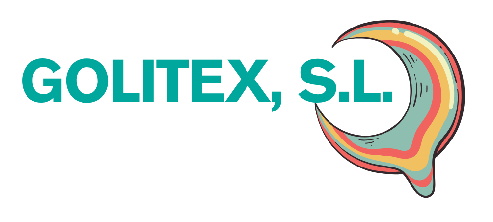
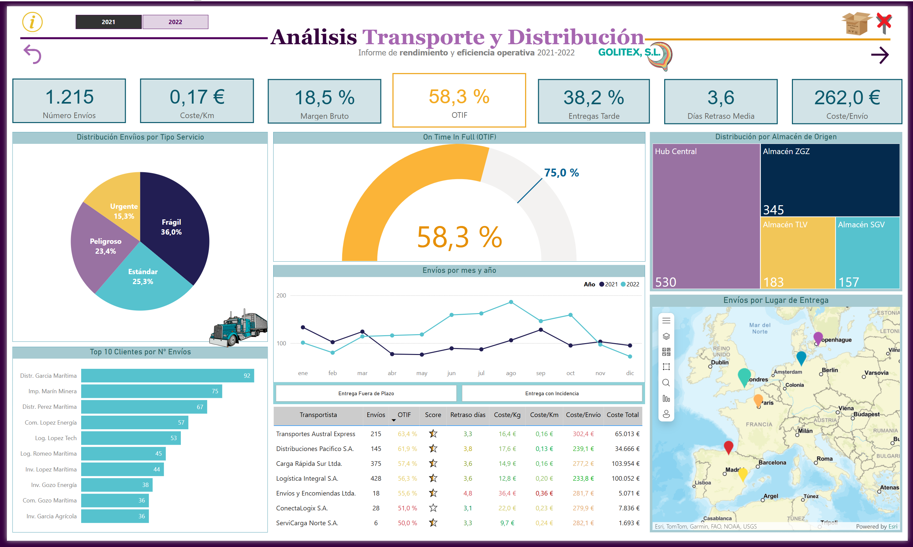
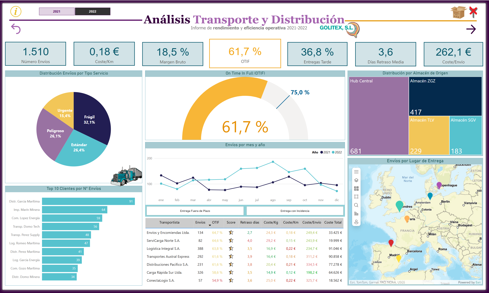
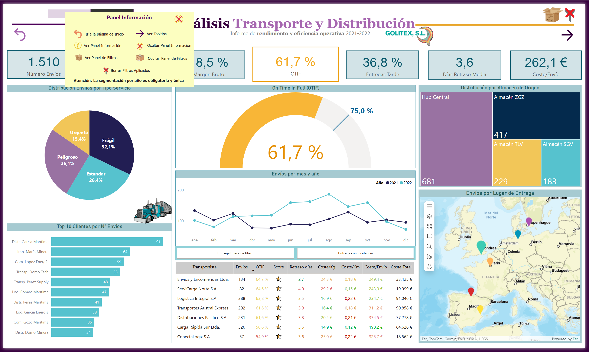
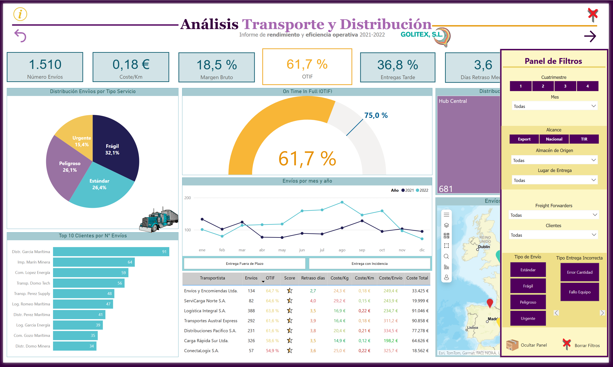
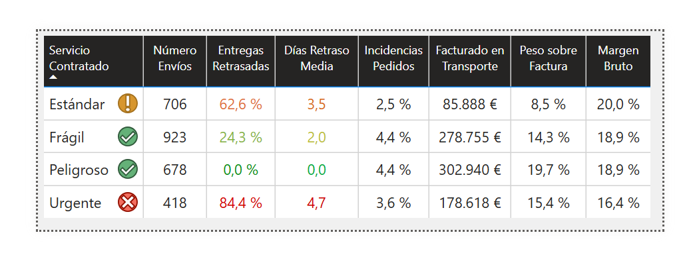
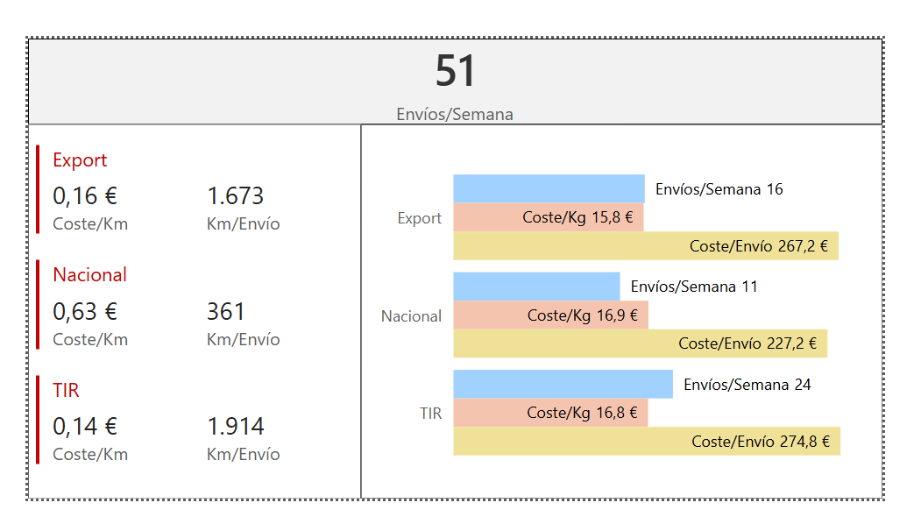
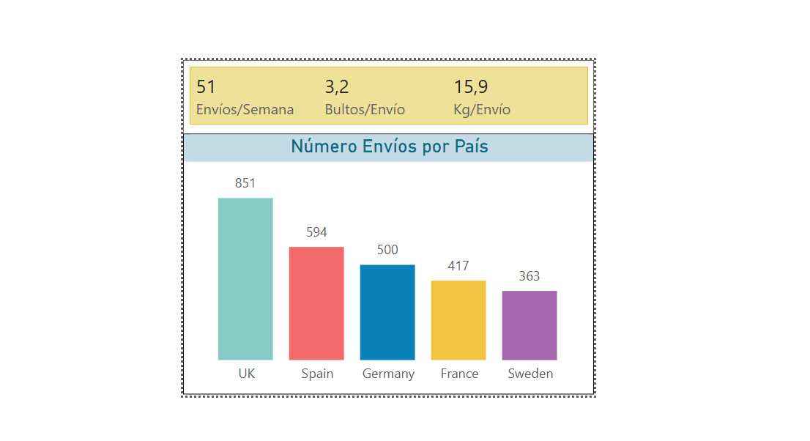
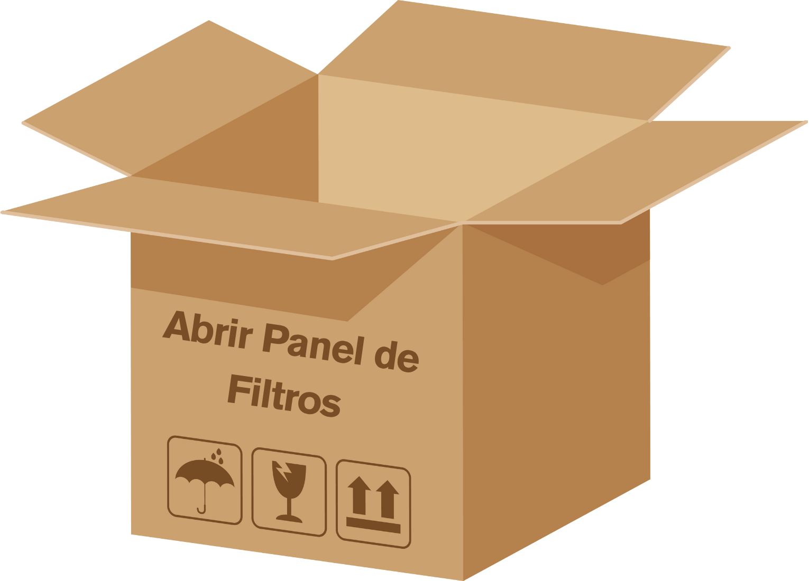

# 🚛 Golitex – Análisis Transporte & Distribución



## 🧭 Descripción del proyecto

Este proyecto es un **caso de estudio ficticio** para la empresa inventada **Golitex, S.L.**, dedicada a la distribución nacional e internacional de mercancías.  

Su objetivo es:
- Analizar **costes logísticos**, tiempos de entrega y eficiencia operativa.
- Evaluar la puntualidad y fiabilidad de transportistas.
- Identificar **oportunidades de optimización de rutas y costes**.
- Presentar **KPIs visuales y accionables** a través de un dashboard en Power BI.

📊 **Tipo de datos:**  
Datos sintéticos creados en Excel.

---

## 📊 Vistas del Dashboard

| Portada | Vista Anual |
|---------|-------------|
|  |  | 

| Info | Panel Filtros |
|-----------|-------------------|
|  |  |

---

## 🎯 Objetivos y KPIs

- 💰 **Coste por km** por almacén, país, cliente y tipo de servicio.  
- 📦 **OTIF (On-Time In-Full)** y % de retrasos.  
- ⏱️ **Días de retraso medio** en entregas tardías.  
- 🧾 Margen bruto aproximado.  
- 🧭 Desempeño por tipo de servicio y transportista (FFW).  
- 🗓️ Volumen mensual y anual de envíos.

---

## 🧭 Navegación e interactividad

El dashboard permite al usuario:
- Cambiar entre vistas **por año**, **país**, **tipo de servicio**, **cliente** o **transportista**.  
- Ver **tooltips** con detalles operativos al pasar el ratón.  
- Acceder rápidamente a paneles de información y conclusiones mediante botones interactivos.

---

### 🖱️ Tooltips

| Tooltip Tipo Servicio | Tooltip Costes | Tooltip Lugar de Entrega y Volumen |
|-----------------------|----------------|------------------------------------|
|  |  |  |

---

### 🖱️ Iconos (Canva)

| Abrir Filtros | Cerrar Filtros | Conclusiones | Información |
|---------------|----------------|--------------|--------------|
|  |  |  |  |

---

## 📂 Estructura de carpetas

```plaintext
04_Gestión_Transporte/
├─ Dashboard/                (PBIX local - no subido)
├─ Datos/
│  └─ data.xlsx              (dataset sintético)
├─ Imágenes/
│  ├─ Dashboard/             (capturas del dashboard)
│  ├─ Logos/                 (logos de marca)
│  └─ Segmentaciones/        (iconos para botones interactivos)
└─ Informe/
   └─ Conclusiones_dashboard.pdf

---

## 📥 Acceso al PBIX original

> 📌 *El archivo `.pbix` no se sube al repositorio debido a su tamaño.  
> [Acceso al Dashboard PBIX] (https://app.powerbi.com/links/U4yaRx9zva?ctid=899789dc-202f-44b4-8472-a6d40f9eb440&pbi_source=linkShare&bookmarkGuid=c8f78832-cdae-4346-9d5d-6243dcc5d727)


---

## 📈 Insights & Acciones

Este resumen recoge los hallazgos clave del análisis y las acciones estratégicas recomendadas para optimizar la red logística de **Golitex, S.L.**

| Nº | 📊 Insight                                                                 | 🛠️ Acción Recomendada                                                                                                 |
|----|-----------------------------------------------------------------------------|-----------------------------------------------------------------------------------------------------------------------|
| 1  | El 65 % de los costes totales provienen de rutas con baja consolidación de carga y trayectos largos. | Priorizar rutas consolidadas, agrupar envíos pequeños y renegociar tarifas con transportistas de bajo volumen. |
| 2  | El 22 % de los retrasos se concentran en 3 rutas críticas (zona norte).     | Revaluar la planificación horaria e introducir buffers de tiempo en esas rutas clave.                                |
| 3  | Dos FFW concentran el 70 % de los envíos, pero con diferencias significativas de puntualidad. | Implementar un **Vendor Scorecard**, negociar SLA más estrictos o redistribuir volúmenes de carga.              |
| 4  | El servicio “Urgente” tiene un coste por km un 40 % superior al promedio y solo representa el 10 % del volumen total. | Optimizar la asignación de urgencias y reservar este servicio para operaciones de alto valor.                   |
| 5  | Se detectan picos de coste en marzo y septiembre por planificación ineficiente de carga. | Realizar simulaciones mensuales y aplicar medidas preventivas para equilibrar capacidad y demanda.             |

---

### 📌 Resumen ejecutivo

- 📉 **Reducción estimada de costes logísticos:** 12 – 18 % mediante optimización de rutas y renegociación de tarifas.  
- ⏱️ **Mejora en puntualidad estimada:** +9 puntos OTIF actuando sobre rutas críticas.  
- 🚀 **Eficiencia global:** potencial de +15 % con medidas de consolidación y planificación avanzada.

---

## 📄 Licencia y créditos

- Código y documentación: **MIT License**.  
- Iconografía y logos: creados en **Canva**.  
- Marca **Golitex, S.L.** y datos ficticios.

---

## ✍️ Autora

**Elena Sánchez-Laulhé**  
Supply Chain & Logistics - Data Analytics  
GitHub: [@esanchezlaulhe1312](https://github.com/esanchezlaulhe1312)
LinkedIn: [elenaSanchezLaulhe](https://www.linkedin.com/in/elena-sanchez-laulhe/)

---
